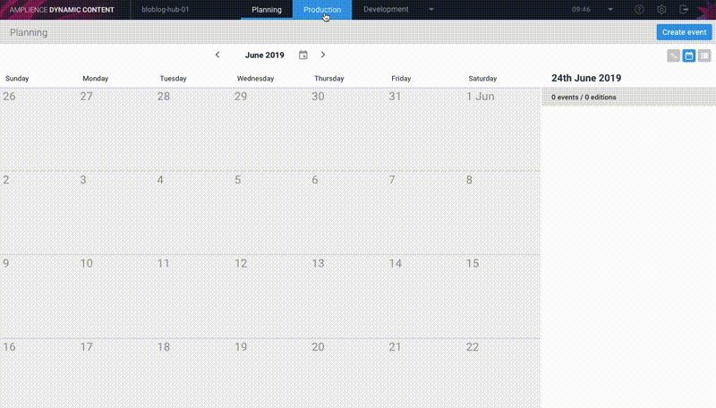

[](https://amplience.com/dynamic-content)

# dc-static-blog-nextjs


This is an application built using the Amplience Dynamic Content Service and the NextJS framework that generates a static blog website.

# How To Use

To use this application you will need to install the content schemas (see ./schema/\*.json) in Dynamic Content and have some way of running the application, either on your local machine or hosted via a static site platform (for this guide we have used [Netlify](https://www.netlify.com) but you can use [Zeit](https://zeit.co/) if you wish).

Once you have everything installed you can then create new blog posts and schedule them for when you want them to go live on your blog.


# Installation

To install and use this blog you first need to create the required schemas and register the Content Types in Dynamic Content.

## Content Type Schemas

| Filename       | Schema ID                                                                                       | Schema Type  | Visualization Supported |
| -------------- | ----------------------------------------------------------------------------------------------- | ------------ | ----------------------- |
| author.json    | https://raw.githubusercontent.com/amplience/dc-static-blog-nextjs/master/schemas/author.json    | Content Type | No                      |
| blog-list.json | https://raw.githubusercontent.com/amplience/dc-static-blog-nextjs/master/schemas/blog-list.json | Content Type | Yes                     |
| blog-post.json | https://raw.githubusercontent.com/amplience/dc-static-blog-nextjs/master/schemas/blog-post.json | Content Type | Yes                     |
| blog-slot.json | https://raw.githubusercontent.com/amplience/dc-static-blog-nextjs/master/schemas/blog-slot.json | Slot         | No                      |
| image.json     | https://raw.githubusercontent.com/amplience/dc-static-blog-nextjs/master/schemas/image.json     | Content Type | Yes                     |
| text.json      | https://raw.githubusercontent.com/amplience/dc-static-blog-nextjs/master/schemas/text.json      | Content Type | Yes                     |
| video.json     | https://raw.githubusercontent.com/amplience/dc-static-blog-nextjs/master/schemas/video.json     | Content Type | Yes                     |

### Creating Schemas & Registering Content Types

In Dynamic Content, navigate to the "Content type schemas" area (Developer -> Content type schemas).

For each of the Content Type Schemas listed above:-

1. Click on "Create schema"
2. Enter the Schema Id
3. Select the Schema Type from the drop down menu
4. Click "Save & open schema"
5. Open the .json file and copy & paste in the JSON content into the editor, overwriting the existing JSON.
6. Click "Save" (top right)

Navigate to the "Content types" area (Developer -> Content types).

For each of the Content Types list above:-

1. Click on "Register content type"
2. Select "Internal" for the "Content type schema" option
3. Select the schema from the drop down list
4. Enter a sensible label (e.g. author.json to be "Author")
5. Associate the Content type to the correct repo (blog-slot.json should be in the repo that is marked as Slots)
6. Click "Save".

### Creating A Blog-List & Slot

Once you have installed and registered all of Content schemas, the next step is to create a blog-list Content item and a Slot.
A slot is like a placeholder/pointer to your blog-list, it is also the content entry point when the application runs.

How to create a blog-list content item for your blog:

1. Navigate to the "Production" section
2. Select the repo where you have registered "blog-list.json"
3. Click "Create content"
4. Select the "Blog List" (or whatever label to assigned to the "blog-list.json" content type)
5. Enter a title and a subtitle (these will appear on your blog)
6. Click "Save"

How to create a Blog list "slot", so you can schedule updates to your blog:

1. Navigate to the "Production" section
2. Select your Slots repository
3. Click "Create slots"
4. Select the "Blog Slot" (or whatever label to assigned to the "blog-slot.json" content type)
5. Click the "+" under "Blog list"
6. Click "Add existing"
7. Select your newly created Blog List
8. Click "Save"

Getting the content ID of a slot:-

1. Navigate to the "Production" section
2. Select your Slots repository
3. Find the slot you wish to use
4. In the "..." menu for that item, select "Get content ID"
5. Copy the Content ID, this ID will need to be assigned to the `DYNAMIC_CONTENT_REFERENCE_ID` environment variable



Adding a Blog post to a Blog list

1. Navigate to the "Production" section
2. Select the repo where you have registered "blog-list.json"
3. Edit the previously created Blog list
4. Click the "link" icon and select "Create and add new"
5. Fill out all the fields in the form
6. Click "Save"

Note:

- When adding the blog "Image" we recommend maintaining a 3:1, width:height ratio.
- Recommended video format is MP4 to avoid issues with Safari.

## Deploy To Netlify

Click on the button below to deploy this repository via Netlify.

[](https://app.netlify.com/start/deploy?repository=https://github.com/amplience/dc-static-blog-nextjs)

### Netlify Build Settings

During the Netlify setup process you will need to define the following build environment variables

| Environment Var                   | Required | Description                                                                                                     | Example                                |
| --------------------------------- | -------- | --------------------------------------------------------------------------------------------------------------- | -------------------------------------- |
| DYNAMIC_CONTENT_REFERENCE_ID      | Yes      | The ID of the Blog List slot                                                                                    | 00112233-4455-6677-8899-aabbccddeeff   |
| DYNAMIC_CONTENT_ACCOUNT_NAME      | Yes      | Your Amplience Account Name, also known as Endpoint (ths is supplied when your account is created).             | mycompanyid                            |
| DYNAMIC_CONTENT_BASE_URL          | No       | (Optional) Override the Content Delivery Base URL                                                               | https://api.amplience.net              |
| DYNAMIC_CONTENT_SECURE_MEDIA_HOST | No       | (Optional) Allows users with custom hostnames to override the hostname used when constructing secure media URLs | custom-secure-media-host.amplience.net |
| GA_TRACKING_ID                    | No       | (Optional) Google Analytics                                                                                     | UA-1234567890                          |
| BASE_URL                          | Yes\*    | (Optional) Base URL, used in generating links                                                                   | https://blog.example.com               |
| ROBOTS_META_TAG_NOINDEX           | No       | (Optional) Adds a noindex,nofollow meta tag to blog pages                                                       | true                                   |

\* Netlify defines the `BASE_URL` environment variable for each build, meaning you don't have to supply it.

### Automate Netlify Deployments

It is possible to get Netlify to re-build and publish your blog whenever you publish a change in Dynamic Content using a [Dynamic Content Webhook](https://docs.amplience.net/integration/webhooks.html).

#### 1. Create a Netlify "Build hook"

1. Navigate to your Netlify Site settings section for you new blog.
2. Click on "Build & deploy".
3. Scroll down to the "Build hooks" section.
4. Click "Add a build hook".
5. Select the branch you wish to build, e.g. "master"

#### 2. Create a Dynamic Content Webhook

1. Navigate to the "Webhooks" section in Dynamic Content
2. Click "Add webhook"
3. Enter a sensible label (e.g. "Netlify Deployment")
4. Enter the Netlify "build hook" that you created in the previous section as your URL
5. Enable the Webhook trigger "Edition - published"
6. Click "Save"

Notes:

- The "Edition - published" webhook trigger allows you to use the scheduling features of Dynamic Content, allowing you to schedule in advance when your blog will be updated.

## Visualizations & Preview Support

Dynamic Content has two ways of allowing you to see you content changes before they go live:

- [Visualisations](https://docs.amplience.net/production/visualizations.html) provide an effective way of previewing your content directly from within Dynamic Content app during the authoring stage.

- [Previewing content](https://docs.amplience.net/planning/previewingcontent.html) is a great way of viewing how your entire blog site will look at a particular point in time, during the planning stage, before it is published.

### How to Configure Visualizations

For each of the Content Type Schemas that support visualization (see table in [Content Type Schemas](#Content-Type-Schemas)) update each registered content type to include a visualization. The Visualization URI should be the domain with the path of `/visualization.html?vse={{vse.domain}}&content={{content.sys.id}}`, e.g. `http://my-blog.example.com/visualization.html?vse={{vse.domain}}&content={{content.sys.id}}`

### How to configure Preview

You can create a brand new Preview environment using the following Preview application URL: `https://<your-domain>/?vse={{vse.domain}}`.

Notes:

- Blog slot editions will not include any unpublished blog posts as they are a reference link in the blog post. Publishing the newly created blog posts will make them available when using Preview.

# Publishing

Once you are ready to publish your blog within Dynamic Content just publish your new blog post directly from the "Production" side of Dynamic Content (select the context menu for the new blog post and select "Publish"). At first it won't appear on your blog, this is because the blog list needs to be updated to include it.

Remember the blog list and slot that you configured? At build time the application is requesting the slot Content Item which has a "content-link" to the blog list content item, the blog list content item contains an array of "content-references" that each point to a blog post. The content graph looks something like this:-

```
+--------+                +--------+                     +-----------+
|        |                |        |     - - - - - >     | Blog Post |
|  Slot  |    ------>     |  Blog  |                     +-----------+
|        |                |  List  |                     +-----------+
|        |                |        |     - - - - - >     | Blog Post |
+---+----+                +--------+                     +-----------+
           (content-link)             (content-reference)
```

To get the application to display your new blog post you will need to update the Blog List to include your new Blog Post. To do this open your blog list content item, add your new blog post and re-order the list, so that your new blog post is at the top. Then click "Save".
Next you will need to schedule this update using an Dynamic Content Edition.

## Scheduling

_***Note:*** This option is only available if your Webhook is configured using the ***"Edition - Published"*** trigger_

(If you have followed the previous section, so you can skip to step 4.)

1. Create your new Blog Post
2. Publish your new Blog Post (don't worry it wont be visible on your site)
3. Update your Blog List to include your new Blog Post
4. Create a new Event & Edition in the Planner section of Dynamic Content (set when you want your Blog Post to be published on your Blog).
5. Add your Blog Slot to the Edition
6. Add your Blog List into the Blog Slot
7. Click "Schedule the Edition"

When Dynamic Content publishes your updated slot, it will also include your updated Blog List Content Item too, due to the "content-link" between the slot and the Blog List. Dynamic Content will also notify Netlify when it has been published via the webhook you created. You can check on the status of the build by logging into your Netlify account and looking at your build history.


# Local Development

Clone this repo and install the dependencies via npm:

```
npm install
```

## Running Tests

The below command will run unit tests for the project:

```
npm run test
```

## Setup

To setup the application create a `.env` file within the root of the project containing the following - replacing `Content-Id` and `Account-Name` with your values.

```
DYNAMIC_CONTENT_REFERENCE_ID=<Content-Id>
DYNAMIC_CONTENT_ACCOUNT_NAME=<Account-Name>
```

### Using Staging/Other Environments

To use the staging/other environment, the base URL can be overridden to a different value.

```
DYNAMIC_CONTENT_BASE_URL=<Base-URL>
```

### Adding a noindex, nofollow meta tag to pages

It's possible that you do not want the content of the blog indexing just yet, so to help achieve this we have added a flag to add a noindex meta tag in the header of all blog pages.

Preview and visualization pages are always set to not be indexed, the pages that are configurable at the moment are the blog list and article pages.

**N.B. Blog pages are indexed by default.**

```
ROBOTS_META_TAG_NOINDEX=true
```

## Build & Run

First build the application using

```
npm run build
```

The application can then be started with

```
PORT=3000 npm run start
```

Note: Omitting the `PORT` environment var will mean your application will start up on port 5000.

## Run with Developer Mode

To start the application with Developer Mode use

```
PORT=3000 npm run dev
```

Note: Omitting the `PORT` environment var will mean your application will start up on port 3000.

## Export as Static Site

To generate the static site files use

```
npm run export
```

The files will be exported to the `out` directory, these can then be served as a static site.

## Built with

- [Next.js](https://nextjs.org/)
- [Amplience Dynamic Content Delivery API SDK](https://github.com/amplience/dc-delivery-sdk-js)

## Contributing

If you would like to contribute to this project, please follow our [contributing guide](./CONTRIBUTING.md).

## License

This software is licensed under the [Apache License, Version 2.0](http://www.apache.org/licenses/LICENSE-2.0),

Copyright 2019 Amplience

Licensed under the Apache License, Version 2.0 (the "License");
you may not use this file except in compliance with the License.
You may obtain a copy of the License at

    http://www.apache.org/licenses/LICENSE-2.0

Unless required by applicable law or agreed to in writing, software
distributed under the License is distributed on an "AS IS" BASIS,
WITHOUT WARRANTIES OR CONDITIONS OF ANY KIND, either express or implied.
See the License for the specific language governing permissions and
limitations under the License.
