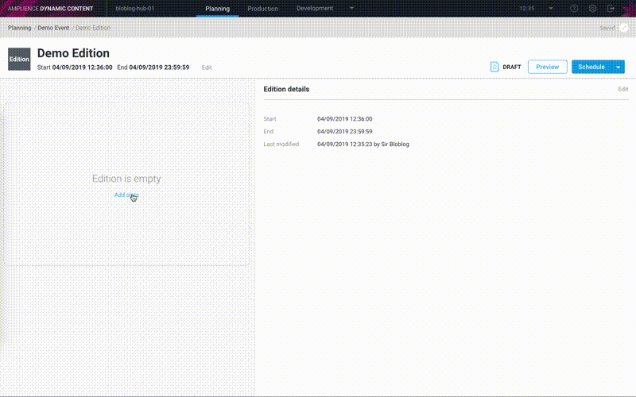

[](https://amplience.com/dynamic-content)

# dc-sample-blog-nextjs


This is an application built using the Amplience Dynamic Content Service and the NextJS framework that generates a static blog website.

# How To Use

To use this application you will need to install the content schemas (see ./schema/\*.json) and setup the search indexes in Dynamic Content and have some way of running the application, either on your local machine or hosted via a static site platform (for this guide we have used [Netlify](https://www.netlify.com) but you can use [Zeit](https://zeit.co/) if you wish).

Once you have everything installed you can then create new blog posts and publish them to your blog.



# Installation

## Content Type Schemas

| Filename       | Schema ID                                                                                       | Schema Type  | Visualization Supported |
| -------------- | ----------------------------------------------------------------------------------------------- | ------------ | ----------------------- |
| author.json    | https://raw.githubusercontent.com/amplience/dc-sample-blog-nextjs/master/schemas/author.json    | Content Type | No                      |
| blog.json      | https://raw.githubusercontent.com/amplience/dc-sample-blog-nextjs/master/schemas/blog.json      | Content Type | Yes                     |
| blog-post.json | https://raw.githubusercontent.com/amplience/dc-sample-blog-nextjs/master/schemas/blog-post.json | Content Type | Yes                     |
| image.json     | https://raw.githubusercontent.com/amplience/dc-sample-blog-nextjs/master/schemas/image.json     | Content Type | Yes                     |
| text.json      | https://raw.githubusercontent.com/amplience/dc-sample-blog-nextjs/master/schemas/text.json      | Content Type | Yes                     |
| video.json     | https://raw.githubusercontent.com/amplience/dc-sample-blog-nextjs/master/schemas/video.json     | Content Type | Yes                     |

### Creating Schemas & Registering Content Types

#### Import using our dc-cli tool (recommended)

You can import the schemas and content types to your hub using the [Dynamic Content CLI](https://www.npmjs.com/package/@amplience/dc-cli).

Install and configure the CLI tool, clone this repository and then use the the CLI import definitions included by running the following commands:

```
git clone https://github.com/amplience/dc-sample-blog-nextjs
cd dc-sample-blog-nextjs
npm install
npx dc-cli --clientId <YOUR_CLIENT_ID> --clientSecret <YOUR_CLIENT_SECRET> --hubId <YOUR_HUB_ID> configure
npm run sync
```

Notes:

- `npm run sync` imports the content-type-schemas and content-types as well as synchronizing any content type changes to your content items.

- The [CLI definitions](/dc-cli-definitions) assume that your hub contains a repository called 'content'. If your repository name is different you will need to update the definitions.

- If you do not want to use the CLI, you can create the schemas and register the content types listed above manually in Dynamic Content.

- Some places in the application use hardcoded values. Please be aware that these values will need to be changed when coding the application:
  - Header title (layouts/default.tsx)
  - Publisher logo/name in JsonLD (components/microdata/microdata.tsx)
  - Social links and Copyright information (components/footer/footer.tsx)

### Creating a Blog content item

Once you have installed and registered (or imported) all of the Schemas and Content Types, the next step is to create a blog content item. This is used to store the title and description for you blog to create the entry point for NextJs to build the blog.

How to create a blog content item for your blog:

1. Navigate to the "Production" section
2. Select the repo where you have registered "blog.json"
3. Click "Create content"
4. Select the "Blog" (or whatever label to assigned to the "blog.json" content type)
5. Enter a title, heading and search placeholder (these will appear on your blog)
6. Enter "blog" in the field \_meta > Delivery key (you may enter another value if you wish). This value will be used later on to retrieve the blog during the build phase.
7. Click "Save"
8. Click "Publish". The blog must be published for it to be available to the Netlify build process later, otherwise the build will fail.

### Creating a production search index for your published blog-posts

1. Navigate to the "Development" section
2. Select "Search Indexes"
3. Click "Create index"
4. Enter a search label (e.g. "blog posts")
5. Select the "Blog post" content type
6. Select "Production" when asked what kind of data is to be stored in this index.
7. Make a note of the index name in the top left (there's a copy text button next to it), we'll be needing this later
8. Select the "Keys" tab and make a note of the "Application ID" & "Search API key".

#### Configure your index

Configure searchable attributes, custom ranking (to ensure) and facets. Respectively these settings will ensure relevant keyword search, sort blog posts by the 'creation date' property (newest first), and enable filtering by author or tag.

On your index select the "Configure" tab and paste in the following configuration and click "Save".

```json
{
  "searchableAttributes": ["title", "description", "content"],
  "customRanking": ["desc(dateAsTimeStamp)"],
  "attributesForFaceting": ["tags", "authors.name"]
}
```

Note that the dateAsTimeStamp attribute used for ranking and sorting will not be available until you have configured the webhook custom payload and published some blog posts (see below).

#### Add sort options

For the sort-by drop menu to work we need to create the following sort options

| Property        | Ordering   |
| --------------- | ---------- |
| dateAsTimeStamp | Ascending  |
| readTime        | Ascending  |
| readTime        | Descending |

From the newly created search index click on the "Add sort option" button in the top right and enter the property and ordering and click "Save & complete" (repeating for each option).

#### Configure webhook custom payload

We have now created a Search Index and series of webhooks that can push and remove data to your search index whenever you publish or archive a Blog Post.

Next we have to customize the webhook payload, as we want change some of the data structures in the search index.

1. Navigate back to your Search Index (if you're not still there)
2. Select the "Webhooks" tab
3. Select the "indexing webhook" or "PUT" webhook, it should be called something like "Search Index: MyHub.blog-posts / Blog post" (you can click directly on the webhook name or via the context menu at the right hand side)
4. Scroll down the bottom of the webhook configuration screen and in "Payload" section replace `{{{JSONstringify this}}}` with the following:

```handlebars
{
  "_meta": {{{JSONstringify _meta}}},
  "title": {{{JSONstringify title}}},
  "description": {{{JSONstringify description}}},
  "deliveryKey": "{{{_meta.deliveryKey}}}",
  "schema": "{{{_meta.schema}}}",
  "authors": [
    {{~#forEach authors~}}
      { "name":"{{{name}}}" }{{#unless isLast}},{{/unless~}}
    {{~/forEach~}}
  ],
  {{#if tags~}}
    "tags": {{{JSONstringify tags}}},
  {{~/if~}}
  "date": "{{{this.date}}}",
  "dateAsTimeStamp": {{{moment date format="X"}}},
  "readTime": {{{readTime}}},
  "content": [
    {{~#each (pluck content "text")~}}
      {{{JSONstringify (sanitize (markdown this) ) }}}{{#unless @last}},{{/unless~}}
    {{~/each~}}
  ],
  "image": {{{JSONstringify image}}}
}
```

5. Click "Save" to save your changes

Notes:

- For more information regarding the webhook payload that is mentioned here, please our documentation - [Optimizing the Algolia record size](https://docs.amplience.net/integration/webhooksearchexamplepart2.html)

### Creating a staging search index for visualization and preview

1. Navigate to the "Development" section
2. Select "Search Indexes"
3. Click "Create index"
4. Enter a search label (e.g. "blog posts - staging")
5. Select the "Blog post" content type
6. Select "Staging" when asked what kind of data is to be stored in this index.
7. Make a note of the index name in the top left (there's a copy text button next to it), we'll be needing this later

#### Configure your index, Add sort options and Configure webhook custom payload

Repeat all of the steps used for your production index to configure your index, add sort options and configure webhook custom payload.

## Deploy To Netlify

Click on the button below to deploy this repository via Netlify.

[](https://app.netlify.com/start/deploy?repository=https://github.com/amplience/dc-sample-blog-nextjs)

### Netlify Build Settings

During the Netlify setup process you will need to define the following build environment variables

#### Required settings

| Environment Var              | Description                                                             | Example                  |
| ---------------------------- | ----------------------------------------------------------------------- | ------------------------ |
| ALGOLIA_APPLICATION_ID       | The search application ID                                               | my-search-application-id |
| SEARCH_API_KEY               | The search API key                                                      | my-search-api-key        |
| SEARCH_INDEX_NAME_PRODUCTION | The production search index name                                        | my-hub.blog-posts        |
| DYNAMIC_CONTENT_DELIVERY_KEY | The Delivery Key of the Blog                                            | blog                     |
| DYNAMIC_CONTENT_HUB_NAME     | Your Dynamic Content Hub name (find this under Settings --> Properties) | my-hub                   |

#### Optional settings

| Environment Var                   | Description                                                                                          | Example                                |
| --------------------------------- | ---------------------------------------------------------------------------------------------------- | -------------------------------------- |
| DYNAMIC_CONTENT_BASE_URL          | Override the Content Delivery Base URL                                                               | https://api.amplience.net              |
| DYNAMIC_CONTENT_SECURE_MEDIA_HOST | Allows users with custom hostnames to override the hostname used when constructing secure media URLs | custom-secure-media-host.amplience.net |
| GA_TRACKING_ID                    | Google Analytics                                                                                     | UA-1234567890                          |
| BASE_URL\*                        | Base URL, used in generating links                                                                   | https://blog.example.com               |
| ROBOTS_META_TAG_NOINDEX           | Adds a noindex,nofollow meta tag to blog pages                                                       | true                                   |
| SEARCH_INDEX_NAME_STAGING         | The Algolia staging index name, used for previewing content                                          | my-hub.staging-blog-posts              |
| AUTHORS_FACET_FIELD               | The name of the faceted field for authors                                                            | authors.name                           |
| TAGS_FACET_FIELD                  | The name of the faceted field for tags                                                               | tags                                   |
| HITS_PER_PAGE                     | The number of results to load from the search index (defaults to 10)                                 | 9                                      |

\* Netlify defines the `BASE_URL` environment variable for each build, meaning you don't have to supply it.

### Automate Netlify Deployments

It is possible to get Netlify to re-build and publish your blog whenever you publish a change in Dynamic Content using a [Dynamic Content Webhook](https://docs.amplience.net/integration/webhooks.html).

#### 1. Create a Netlify "Build hook"

1. Navigate to your Netlify Site settings section for you new blog.
2. Click on "Build & deploy".
3. Scroll down to the "Build hooks" section.
4. Click "Add a build hook".
5. Select the branch you wish to build, e.g. "master"

#### 2. Create a Dynamic Content Webhook

1. Navigate to the "Webhooks" section in Dynamic Content
2. Click "Add webhook"
3. Enter a sensible label (e.g. "Netlify Deployment")
4. Enter the Netlify "build hook" that you created in the previous section as your URL
5. Enable the Webhook trigger "Snapshot - Published"
6. Under "Filters", click new and add the JSON path "\$.payload.rootContentItem.contentTypeUri", ensure "Equals" operator is selected and enter "https://raw.githubusercontent.com/amplience/dc-sample-blog-nextjs/master/schemas/blog-post.json" as the value
7. Click "Save"

Notes:

- This will tell Netlify to rebuild your blog whenever you publish any Blog post changes

## Visualizations & Preview Support

Dynamic Content has two ways of allowing you to see you content changes before they go live:

- [Visualizations](https://docs.amplience.net/production/visualizations.html) provide an effective way of viewing a single content item directly from within Dynamic Content app during the authoring stage.
- [Previewing content](https://docs.amplience.net/planning/previewingcontent.html) is a great way of viewing how your entire blog site will look, showing the latest saved content before it is published.

### How to Configure Visualizations

For each of the Content Type Schemas that support visualization (see table in [Content Type Schemas](#Content-Type-Schemas)) update each registered content type to include a visualization. The Visualization URI should be the domain with the path of `/visualization/?vse={{vse.domain}}&content={{content.sys.id}}`, e.g. `https://blog.example.com/visualization/?vse={{vse.domain}}&content={{content.sys.id}}`

If you used the dc-cli tool to register your content types, they will already have visualizations added, so you just need to update each URI with the correct domain. You can do this by updating the CLI definitions in /dc-cli-definitions and running the `npm run sync` command again, or by manually updating your content types in Dynamic Content.

### How to configure or open Preview

To enable opening the application via the 'Preview' button in the Dynamic Content app's Planning section:

- Go to Hub settings > "Preview" in Dynamic Content. The Preview application URL should be the domain with the path of `/?vse={{vse.domain}}`, e.g.: `https://blog.example.com/?vse={{vse.domain}}`.
  To open the preview application directly in your browser:
- Go to Hub settings > "Preview" in Dynamic Content. Copy the Default preview staging environment domain. THis is your VSE domain.
- In your browser, go to your blog domain with with the preview domain passed in to the URL parameter `/?vse=`, e.g. `https://blog.example.com/?vse=example.staging.bigcontent.io`
  Notes:
- Since blog posts are published on demand, not through an edition, the purpose of the preview application is to display the blog with the latest staged content (current saved versions), no time-based preview will be possible. Therefore it is not required to configure it in Dynamic Content.

# Creating your first blog post

After all of that we now have everything setup and you are ready to start writing your first blog post.

1. In Dynamic Content go to the "Production" tab and select the "Content" repository on the left.
2. Click "Create content" and select the "Blog post" content-type
3. Proceed to fill out the form, you can click on the "( + )" icons to include other content items
4. Once done, click "Save"
5. Next we need to define the "Delivery Key" for this content item, this will become the URL path/slug (e.g. /blog/hello-and-welcome-to-our-new-blog)
6. You can preview your blog post via the visualization icon (the eye) in the toolbar.
7. Once you're happy, go ahead an publish.

# Publishing

Once you are ready to publish your blog within Dynamic Content just publish your new blog post directly from the "Production" side of Dynamic Content (select the context menu for the new blog post and select "Publish").

The webhooks that were generated when you created your search index will push your updates to the search index, and the Netlify webhook will be triggered to rebuild your site.

After a few moments your new blog post should be visible on your Netlify site.

# Local Development

Clone this repo and install the dependencies via npm:

```
npm ci
```

## Running Tests

The below command will run unit tests for the project:

```
npm run test
```

## Setup

To setup the application create a `.env` file within the root of the project containing the following - replacing values with the values you used during the setup of the blog.

```
DYNAMIC_CONTENT_DELIVERY_KEY=<Blog-Delivery-Key>
DYNAMIC_CONTENT_HUB_NAME=<Account-Name>
ALGOLIA_APPLICATION_ID=<SEARCH_INDEX_APPLICATION_ID>
SEARCH_API_KEY=<SEARCH_INDEX_SEARCH_KEY>
SEARCH_INDEX_NAME_PRODUCTION=<SEARCH_INDEX_NAME>
```

### Using Staging/Other Environments

To use the staging/other Dynamic Content environments, the base URL can be overridden to a different value.

```
DYNAMIC_CONTENT_BASE_URL=<Base-URL>
```

### Adding a noindex, nofollow meta tag to pages

It's possible that you do not want the content of the blog indexing just yet, so to help achieve this we have added a flag to add a noindex meta tag in the header of all blog pages.

Preview and visualization pages are always set to not be indexed, the pages that are configurable at the moment are the blog list and article pages.

**N.B. Blog pages are indexed by default.**

```
ROBOTS_META_TAG_NOINDEX=true
```

## Build & Run

First build the application using

```
npm run build
```

The application can then be started with

```
PORT=3000 npm run start
```

Note: Omitting the `PORT` environment var will mean your application will start up on port 5000.

## Run with Developer Mode

To start the application with Developer Mode use

```
PORT=3000 npm run dev
```

Note: Omitting the `PORT` environment var will mean your application will start up on port 3000.

## Export as Static Site

To generate the static site files use

```
npm run export
```

The files will be exported to the `out` directory, these can then be served as a static site.

## Built with

- [Next.js](https://nextjs.org/)
- [Amplience Dynamic Content Delivery API SDK](https://github.com/amplience/dc-delivery-sdk-js)

## Contributing

If you would like to contribute to this project, please follow our [contributing guide](./CONTRIBUTING.md).

## License

This software is licensed under the [Apache License, Version 2.0](http://www.apache.org/licenses/LICENSE-2.0),

Copyright 2019 Amplience

Licensed under the Apache License, Version 2.0 (the "License");
you may not use this file except in compliance with the License.
You may obtain a copy of the License at

    http://www.apache.org/licenses/LICENSE-2.0

Unless required by applicable law or agreed to in writing, software
distributed under the License is distributed on an "AS IS" BASIS,
WITHOUT WARRANTIES OR CONDITIONS OF ANY KIND, either express or implied.
See the License for the specific language governing permissions and
limitations under the License.
